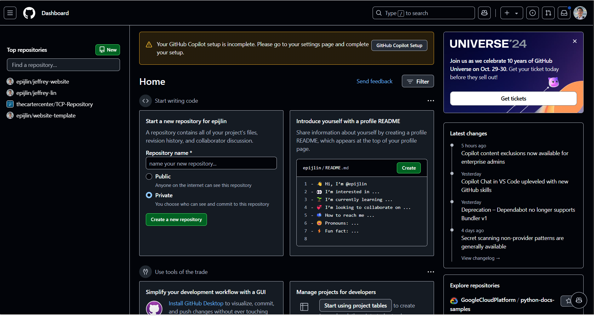

# Jeffrey-Website

This is an instruction for creating a Quarto website using RStudio.

## Check-list

-   [ ] 1. [GitHub web account](https://github.com/)

-   [ ] 2. [Git Bash](https://git-scm.com/)

-   [ ] 3. In RStudio, under **Terminal** near Console or under **Tools** -\> Terminal -\> New Terminal: Full details can be accessed [here](https://chatgpt.com/share/6705a9e6-6058-800d-82ef-e103fb6c95b4/). In short, this is to make sure your Rstudio is properly connected to remote repository on GitHub.

## Step 1: Create a NEW repository on [GitHub](https://github.com/).

github.com -\> Top left hand corner with the **NEW** button. 

**Note:** before creating, make sure Personal Access Token (PAT) is generated on your personal GitHub account (*for general use*). Leave this page open so you can later copy to the Terminal in RStudio. In summary, you will create HTTPS and store it using **gitcreds**.

## Step 2: Linking Local Branch in RStudio to the remote repository on GitHub following below:

-   Template: \$ git remote set-url [https://<your-PAT>\@github.com/<username>/<repositoryname>](https://%3Cyour-PAT%3E@github.com/epijlin/jeffrey-website.git/).

## Step 3:

-   This code changes the branch name from old name to new name: \$ git branch -m <oldname> <newname> eg. \$ git branch -m master main

-   Then, \$ git fetch origin \>\> \$ git rebase origin/main \>\> (once your local branch is up to date with the remote, you can push the changes) \>\> \$ git push -u origin main (push the renamed branch to hte remote)

(Step 2 & Step 3 can be found [here](https://chatgpt.com/share/6705a9e6-6058-800d-82ef-e103fb6c95b4/)

## Step 4: For 'Commit Changes', on the right hand corner box in the Git pane, check boxes of the path and click on Commit -\> In Commit Message 'Type few words' -\> Click on 'Commit'

-\> Click on 'Push' to update the remote repository

## (Set up Pages) Step 5:

-   [ ] 1. You've now left the template page and are viewing your new repo on GitHub. On the home page, click Settings. Click the "Pages" section on the left. In the **Build and Deployment** section, set **Source** to "Deploy from a branch" (Classic Pages experience) and **Branch** to **main** with **/docs** folder. Click Save.

-   [ ] 2. Click the little gear button near "About" on the top right side of the home page of the repo and check the "Use your Github Pages website" box under "Website". Click "Save changes". Test the link and you should see a web site with a stick figure on it. It may take a few minutes to build so if it's not working do a few more steps and then come back to check.

## Step 6: Edit `_quarto.yml` (RStudio)

-   [ ] 1. Edit the all caps info in `_quarto.yml` to your info. It's very important to maintain the indenting structure in this file precisely as is -- be careful!

## Step 7: Render the web site (RStudio)

-   [ ] 1. If you haven't already, click "Help" "Check for Updates" to make sure you have the latest version of RStudio (and thus have Quarto installed.)

-   [ ] 2. Render the web site locally by clicking the "Build" tap on the right and then "Render Website".

-   [ ] 3. Use `browseURL("docs/index.html")` to view your site locally (or just open `docs/index.html` in a browser).

-   [ ] 4. If it looks good, commit and push all changed files to GitHub.

(You will need to repeat steps 2 and 4 every time you wish to update the book online.)

## Step 8: Next steps

-   Add content to `index.qmd` as desired.

-   Add content to `projects.qmd` as desired.

-   Change the photo in the `img` folder to your photo.

-   Choose a theme from <https://bootswatch.com/> and replace "cerulean" in `_quarto.yml` with your prefered theme.

-   Add additional tabs/sections by creating new `.qmd` files and listing them in `_quarto.yml` under `projects.qmd`.

## Additional features

Please consult the official guide to **quarto** web sites: <https://quarto.org/docs/websites/>

## Last but not least

Once you've completed these steps, delete the content of this **README** and add a short description of your project with a link to the book URL. It would be appreciated if you add the following to the end:

*This repo was initially generated from a Quarto template available here: https://github.com/jtr13/website-template.*

(And starring the repo would be nice too!)

### Additional information on GitHub can be found [here](https://docs.github.com/en/repositories/managing-your-repositorys-settings-and-features/customizing-your-repository/about-readmes/)

## In `_quarto.yml`, `toc` stands for table of content. If true, it will show on the right sidebar. 

- `css: styles.css` indicates create a file called styles.css and that you can customize the font size
